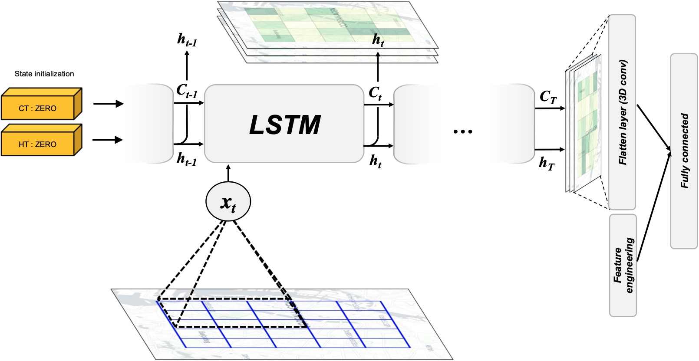

# Demand prediction at GreenMobility using Spatio-Temporal Models
*DTU 02456 course project*

This is the **public** repository associated with the project which has been edited to allow for public view
 

## Project introduction
For Mobility as a Service providers availability is key. GreenMobility, which this project evolves around, operates a free floating car sharing service meaning that the driver can end the trip wherever and whenever, as long as it is within designated zones. This can lead to situations with unbalanced distributions of cars within zones. The objective of this paper is to present methods for Spatiotemporal demand modelling of the very near futures. 
Studies have shown that the distance that people are willing to walk for public transportation is very low and estimated at 400m. Internal surveys and analyses of the usage patterns of GreenMobility users, has shown similar tendencies and that the probability of a customer starting a car rental decreases steeply with the distance to the nearest car. Because the distance to cars have such a high influence on rentals and thereby revenue, an accurate forecasting system is of high interest.
The use of demand prediction systems directly dictates how and where employees of GreenMobility relocate cars. In the future it could also have a large influence on a dynamic pricing system which would aim to increase utilisation and outsource relocation of cars to the customer. The current system in place at GreenMobility is a group of experienced employees which dictate relocation assignment based on live fleet data and intuition. 

Due to the confidentiality of the dataset, information that might reveal specific values about it have been omitted and presented in a way that might reflect the general state of it.

## Project abstract:
This paper assesses Convolutional LSTM networks for demand prediction of Mobility as a Service with free floating fleets. We seek to model the time and place of a successful car rental by creating a spatiotemporal model for near future rentals based on data provided by GreenMobility.\\
The primary approach is the Convolutional LSTM which is compared to multiple output LSTM, and linear regression. The results show that when using the proposed modelling of demand as only a the car location of a successful rental, the Convolutional LSTM does not yield significantly better results than a more simple models as linear regression with time-related independent variables.

**Visualisation of convolutional LSTM architecture**

**A public version of the report will soon be available**

## Aknowlegedements
* The project is inspired by Xingjian Shi, Zhourong Chen, Hao Wang, Dit-Yan Ye-ung, Wai kin Wong, and Wang chun Woo, “Convolu-tional lstm network:  A machine learning approach forprecipitation nowcasting,” 2015

* The code for the convolutional LSTM Cell originates from [ndrplz's](https://github.com/ndrplz/ConvLSTM_pytorch) implementation of the Convolutional LSTM cell. 

* The moving MNIST models are inspired [this](https://towardsdatascience.com/video-prediction-using-convlstm-with-pytorch-lightning-27b195fd21a2) article by [holmdk](https://github.com/holmdk)

* The moving MNIST data set originates from the [University of Toronto](http://www.cs.toronto.edu/~nitish/unsupervised_video/) and used [tychovdo's](https://github.com/tychovdo/MovingMNIST) dataloader

For a full list please see references from associated article.